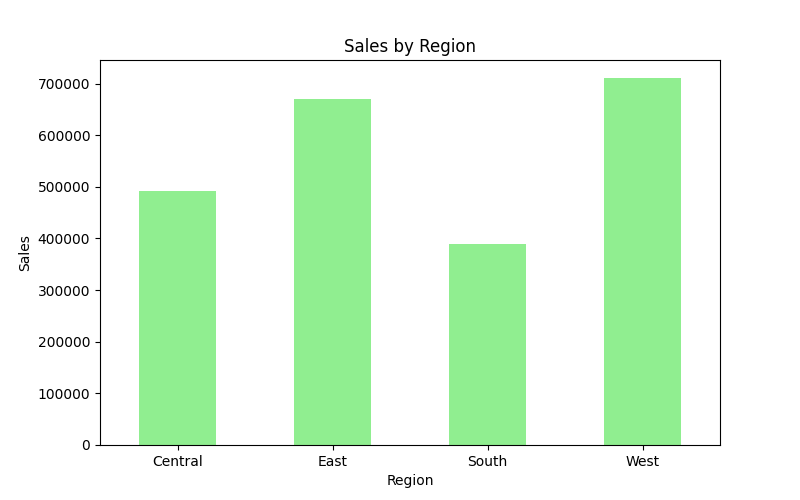
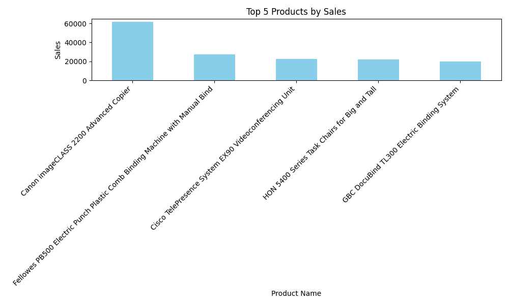
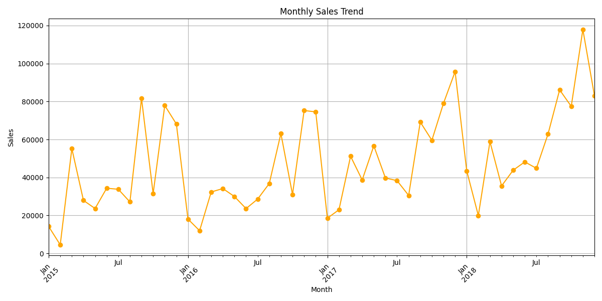

# Sales Data Analysis and Forecasting

This project analyzes retail sales data using Python.

## Steps Performed
- Data cleaning and handling missing values
- Exploratory Data Analysis (EDA)
- Data visualization of sales trends
- Built a Linear Regression model to predict monthly sales
- Model evaluated using R² score

## Visualizations

### Sales by Region

### Top Selling Products

### Monthly Sales Trend

## Tools Used
Python, Pandas, Matplotlib, Scikit-learn
